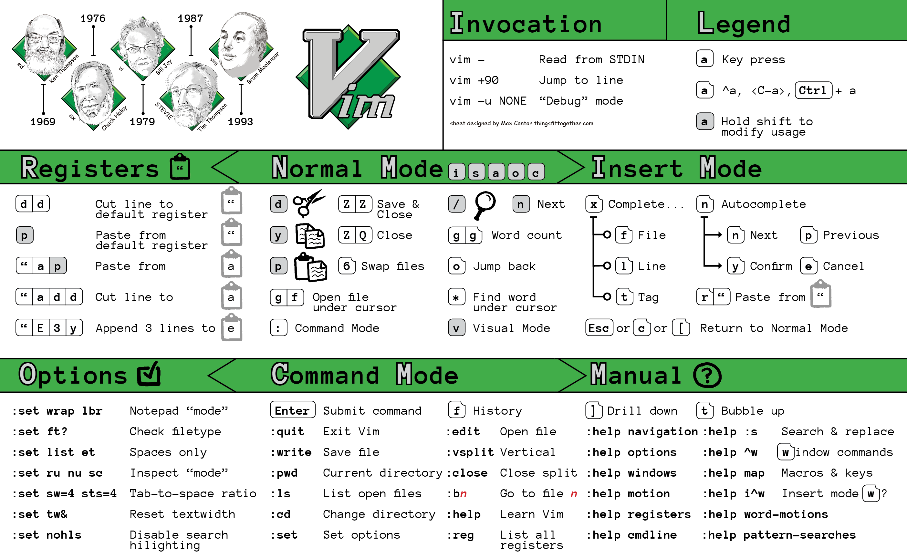

# The Ten Computer Science Superpowers 
This page is currently being developed and will be updated during the course.

**⚠️ Disclaimer** 

This page is not intended to be exhaustive and complete but should be considered a starting point for learning daily practical (side) tools for a computer programmer.
## \#1️⃣ The Shell

### What is the shell?

Computers these days have a variety of interfaces for giving them commands; fanciful graphical user interfaces, voice interfaces, and even AR/VR are everywhere. These are great for 80% of use-cases, but they are often fundamentally restricted in what they allow you to do — you cannot press a button that isn’t there or give a voice command that hasn’t been programmed. To take full advantage of the tools your computer provides, we have to go old-school and drop down to a textual interface: The Shell.

Nearly all platforms you can get your hand on has a shell in one form or another, and many of them have several shells for you to choose from. While they may vary in the details, at their core they are all roughly the same: they allow you to run programs, give them input, and inspect their output in a semi-structured way.

In this lecture, we will focus on the Bourne Again SHell, or “bash” for short. This is one of the most widely used shells, and its syntax is similar to what you will see in many other shells. To open a shell prompt (where you can type commands), you first need a terminal. Your device probably shipped with one installed, or you can install one fairly easily.

### Resources 4 Geek
- [Zsh vs Bash](https://www.geeksforgeeks.org/bash-scripting-difference-between-zsh-and-bash/)
- [Make your terminal beautiful and fast with ZSH shell and PowerLevel10K](https://medium.com/@shivam1/make-your-terminal-beautiful-and-fast-with-zsh-shell-and-powerlevel10k-6484461c6efb)
- [Windows per Linux (WSL) ](https://learn.microsoft.com/it-it/windows/wsl/)
- macOS
  - [iTerm2](https://iterm2.com/)
  - [Warp](https://www.warp.dev/)

### Must to know commands and software

- ```top``` and ```htop```, information of running tasks, memory, cpu, and swap
  - or also more advanced tools, such as [btop](https://github.com/aristocratos/btop)
- Software package management systems see this [list](https://en.wikipedia.org/wiki/List_of_software_package_management_systems)
  - [APT](https://it.wikipedia.org/wiki/Advanced_Packaging_Tool) (unix), [Homebrew](https://brew.sh/index_it) (macOS), ...
- 🔝 50 commands 🌟:
<details><summary>Show commands</summary>

  1.  **ls** - The most frequently used command in Linux to list directories
  2.  **pwd** - Print working directory command in Linux
  3.  **cd** - Linux command to navigate through directories
  4.  **mkdir** - Command used to create directories in Linux
  5.  **mv** - Move or rename files in Linux
  6.  **cp** - Similar usage as mv but for copying files in Linux
  7.  **rm** - Delete files or directories
  8.  **touch** - Create blank/empty files
  9.  **ln** - Create symbolic links (shortcuts) to other files
  10.  **cat** - Display file contents on the terminal
  11.  **clear** - Clear the terminal display
  12.  **echo** - Print any text that follows the command
  13.  **less** - Linux command to display paged outputs in the terminal
  14.  **man** - Access manual pages for all Linux commands
  15.  **uname** - Linux command to get basic information about the OS
  16.  **whoami** - Get the active username
  17.  **tar** - Command to extract and compress files in Linux
  18.  **grep** - Search for a string within an output
  19.  **head** - Return the specified number of lines from the top
  20.  **tail** - Return the specified number of lines from the bottom
  21.  **diff** - Find the difference between two files
  22.  **cmp** - Allows you to check if two files are identical
  23.  **comm** - Combines the functionality of diff and cmp
  24.  **sort** - Linux command to sort the content of a file while outputting
  25.  **export** - Export environment variables in Linux
  26.  **zip** - Zip files in Linux
  27.  **unzip** - Unzip files in Linux
  28.  **ssh** - Secure Shell command in Linux
  29.  **service** - Linux command to start and stop services
  30.  **ps** - Display active processes
  31.  **kill and killall** - Kill active processes by process ID or name
  32.  **df** - Display disk filesystem information
  33.  **mount** - Mount file systems in Linux
  34.  **chmod** - Command to change file permissions
  35.  **chown** - Command for granting ownership of files or folders
  36.  **ifconfig** - Display network interfaces and IP addresses
  37.  **traceroute** - Trace all the network hops to reach the destination
  38.  **wget** - Direct download files from the internet
  39.  **ufw** - Firewall command
  40.  **iptables** - Base firewall for all other firewall utilities to interface with
  41.  **apt, pacman, yum, rpm** - Package managers depending on the distro
  42.  **sudo** - Command to escalate privileges in Linux
  43.  **cal** - View a command-line calendar
  44.  **alias -** Create custom shortcuts for your regularly used commands
  45.  **dd** - Majorly used for creating bootable USB sticks
  46.  **whereis** - Locate the binary, source, and manual pages for a command
  47.  **whatis** - Find what a command is used for
  48.  **top** - View active processes live with their system usage
  49.  **useradd and usermod** - Add new user or change existing users data
  50.  **passwd** - Create or update passwords for existing users
</details>

- 💡 **Remember to use the ```man``` command to see the documentation of each tool/command.**

## \#2️⃣ Finding files and regular expressions

**_Avoid repetitive tasks or use tools to help in such tasks!_** 

For instance, it is vital to use tools for finding files or search content in file.

### ```find```
All UNIX-like systems provide a package named find, a tool to find files, and it will recursively search for files matching specific criteria.

```bash
# Find all directories named src
find . -name src -type d
# Find all python files that have a folder named test in their path
find . -path '*/test/*.py' -type f
# Find all files modified in the last day
find . -mtime -1
# Find all zip files with size in range 500k to 10M
find . -size +500k -size -10M -name '*.tar.gz'
# Delete all files with .tmp extension
find . -name '*.tmp' -exec rm {} \;
# Find all PNG files and convert them to JPG
find . -name '*.png' -exec convert {} {}.jpg \;
```

### ```fd```
It is an alternative to the find command and promises to offer better and more comprehensive outputs.

**Install:** ```brew install fd``` or see [Github](https://github.com/sharkdp/fd) page also for documentation.

### ```grep```
The find command permits you to search files using names or matching patterns, while the grep command allows you to find inside the content of your files, such as searching specific lines of codes and more.

```bash
# Search all file that contains the string hello of types txt and doc
grep -r --include=\*.{txt,doc} "hello" .
# Ignore case
grep -i "this" test-file
# Count the number of patterns
ps -ef | grep -c $USER
# Display line numbers of a match
grep -n "set" ~/.zshrc
```

It is also helpful in finding your command history ```history | grep find```.

### Regular Expressions
//TODO description of regular expression and different flavors

Basic patterns:

- `.` means “any single character” except newline
- `*` zero or more of the preceding match
- `+` one or more of the preceding match
- `[abc]` any one character of a, b, and c
- `(Hello|Ciao)` either something that matches Hello or Ciao
- `^` the start of the line
- `$` the end of the line

**Debugging regular expression** on [egex101.com](https://regex101.com/).
## \#3️⃣ Remote machines

```ssh``` Secure Shell Protocol (SSH) is a cryptographic network protocol for operating network services securely over an unsecured network. SSH applications are based on a client–server architecture, connecting an SSH client instance with an SSH server.
- ssh key exchange //TODO
- ssh tunneling //TODO

```tmux``` is a terminal multiplexer, allowing you to use multiple programs in a single terminal.
- [Getting Started with Tmux](https://github.com/tmux/tmux/wiki/Getting-Started)

## \#4️⃣ Text editing and IDE
```vi``` and ```vim``` //TODO



```nano``` //TODO

```emacs``` //TODO

```Visual Studio Code``` //TODO

## \#5️⃣ Version Control (Git)
//TODO
## \#6️⃣ Metaprogramming
//TODO
## \#7️⃣ Shortcuts and layout manager
//TODO
## \#8️⃣ Markdown
//TODO
## \#9️⃣ Docker and VMs
//TODO
## \#1️⃣0️⃣ Notebooks programming
//TODO